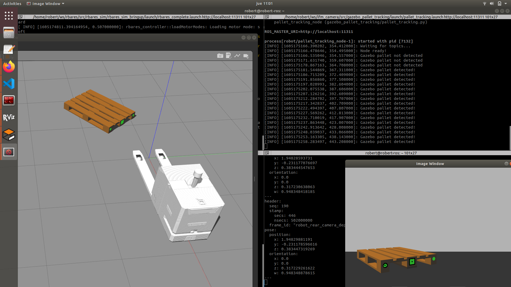

# gazebo_pallet_tracking

# Overview

This packages provides a detection system for pallets using Gazebo. An europallet model has been modified and
now it has three marks for detection. OpenCV detects the color of the marks and filters the image. After that,
it runs a algortihn to detect the shapes of the marks. With this localization and the pointcloud of the camera
we get the distance. Finally, the position and orientations is calculated.

# User guide

1. Make sure that you have running a simulation with a camera in gazebo

2. Check the camera topics. Get the name topics for image_raw and points

3. Set the camera topics in the launch file ```gazebo_pallet_tracking/launch/pallet_tracking.launch``` In this example:

```
<?xml version="1.0"?>
<launch>

    <arg name="robot_id" default="robot" />
    <arg name="camera_topic" default="rear_camera/rgb/image_raw" />
    <arg name="camera_depth_topic" default="rear_camera/depth/points" /> 
 
  <node...

```
4. Spawn the europallet model in the simulation. This model has a three markers for detection. Add the model
into your ./gazebo models folder:

```
$ roscd gazebo_pallet_tracking
$ cp ./europallet  ~/.gazebo/models
```

5. Run pallet detection:

```
$ roslaunch gazebo_pallet_tracking pallet_tracking.launch
```
6. A window will be opened. You will see if a pallet is detected or not



# Limitations

1. You have to work with the europallet of this package. This pallet has been modified and it has
three marks for detection

2. Only one pallet can be detected. If there are two pallets in the same detection range the
behavior will be unexpected.

